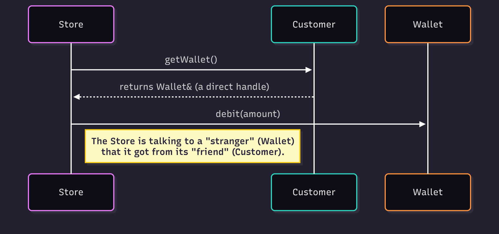
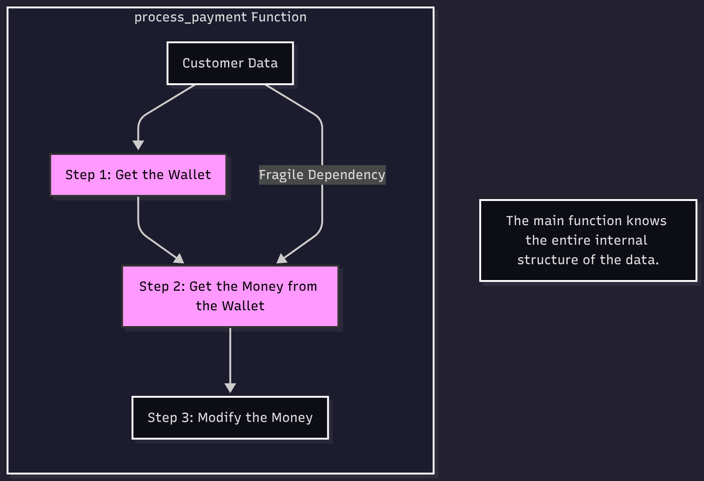
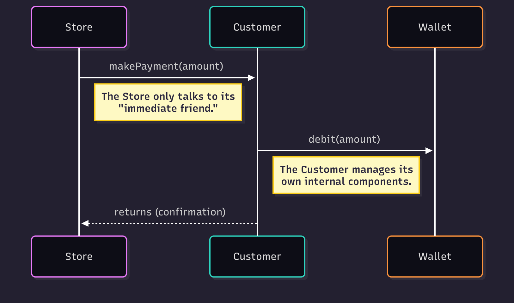
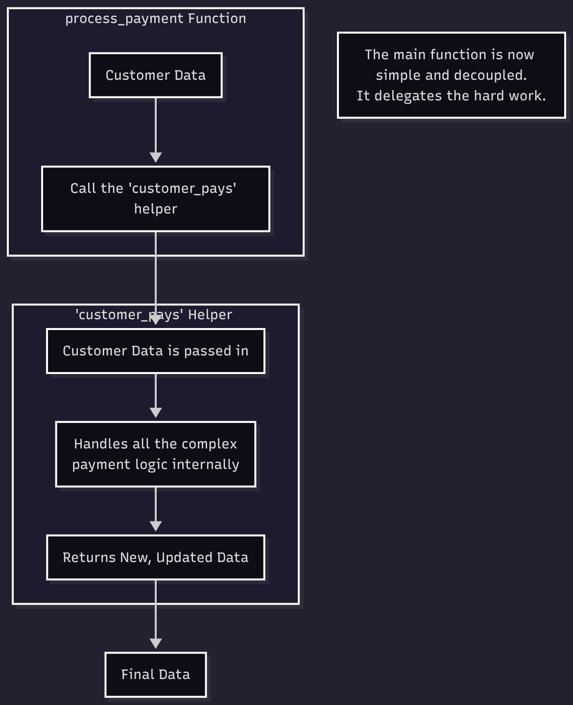

# The Law of Demeter (Principle of Least Knowledge)

A simple guide to understanding the Law of Demeter (LoD), explained with practical examples in both **Object-Oriented (C++)** and **Functional (Python)** paradigms.

## What is the Law of Demeter? 

The **Law of Demeter**, also known as the **Principle of Least Knowledge**, is a design guideline for developing software. In simple terms, a unit should have as little knowledge as possible about the structure and properties of other units.

The core idea is: **"Only talk to your immediate friends."**

This helps you create **loosely coupled** systems, which are easier to maintain, test, and change.

### The "One-Dot" Rule

A quick way to spot a potential violation in object-oriented code is the "one-dot rule." If you see a chain of method calls like `object.getA().getB().doSomething()`, you're probably breaking the law. A single dot, like `object.doSomething()`, is usually fine. While this is a good heuristic, the real goal is to avoid reaching *through* one unit to access a third one.

---

## OOP vs. Functional: Two Sides of the Same Coin

This principle isn't just for objects. It applies to functions and data structures too. This repository demonstrates the concept in both styles.

### Object-Oriented (C++)

In OOP, the law means a method on an object should only call methods belonging to:
* Itself.
* Objects passed in as parameters.
* Objects it creates or instantiates.
* Its own component objects.

Essentially, an object shouldn't peek inside another object to get to a third one. It should just tell its "friend" object what to do and trust it to handle the details.

### Functional (Python)

In a functional paradigm, the law translates to: **A function should not have knowledge of the inner structure of the data passed to it.**

Instead of reaching deep into a nested data structure (e.g., `customer['wallet']['money']`), a function should delegate that work to another helper function that is responsible for that specific data structure. This keeps functions pure, focused, and decoupled from the overall shape of the application's state.

---

## Why Follow This Law? (The Benefits) 

1.  **Reduced Coupling**: Your code isn't dependent on the internal implementation of other components.
2.  **Easier Maintenance**: You can change the internals of a class or a data structure without breaking all the code that uses it.
3.  **Better Encapsulation**: It forces you to hide implementation details and build better, more robust APIs and function contracts.
4.  **Improved Testability**: It's easier to mock or test units that have fewer, more direct dependencies.

---

## Code Examples

This repository demonstrates the Law of Demeter with a clear violation and a refactored solution for each paradigm.

* **`C++/`**: See the principle applied in **Object-Oriented Programming**.
* **`Python/`**: See the principle applied in **Functional Programming**.

### The Scenario

A `Customer` wants to pay a `Store`. To do this, they need to get money from their `Wallet`.

#### The Violation

* **OOP Violation**: The `Store` object reaches through the `Customer` object to get its internal `Wallet` object and then pulls money from it (`customer.getWallet().debit()`). The `Store` knows too much about the `Customer`'s internal parts.
## 

* **Functional Violation**: The `store` function reaches deep into the `customer` data structure to modify a nested value (`customer['wallet']['money'] -= amount`). The function is now tightly coupled to the exact shape of the customer data.
## 

#### The Refactored Solution

* **OOP Fix**: The `Store` simply tells the `Customer` object to pay (`customer.makePayment()`). The `Customer` is responsible for managing its own wallet internally.
## 

* **Functional Fix**: The `store` function calls a `customer_pays()` helper function, delegating the task of handling the payment logic. The main function doesn't need to know how the customer data is structured.
## 